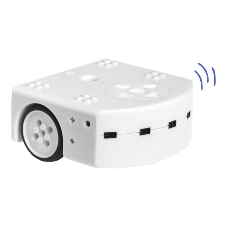
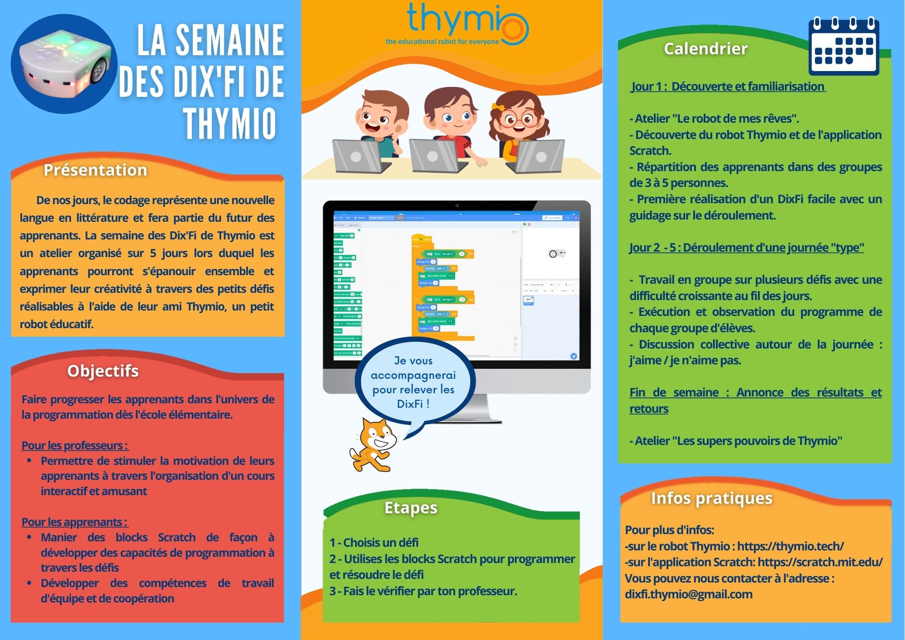
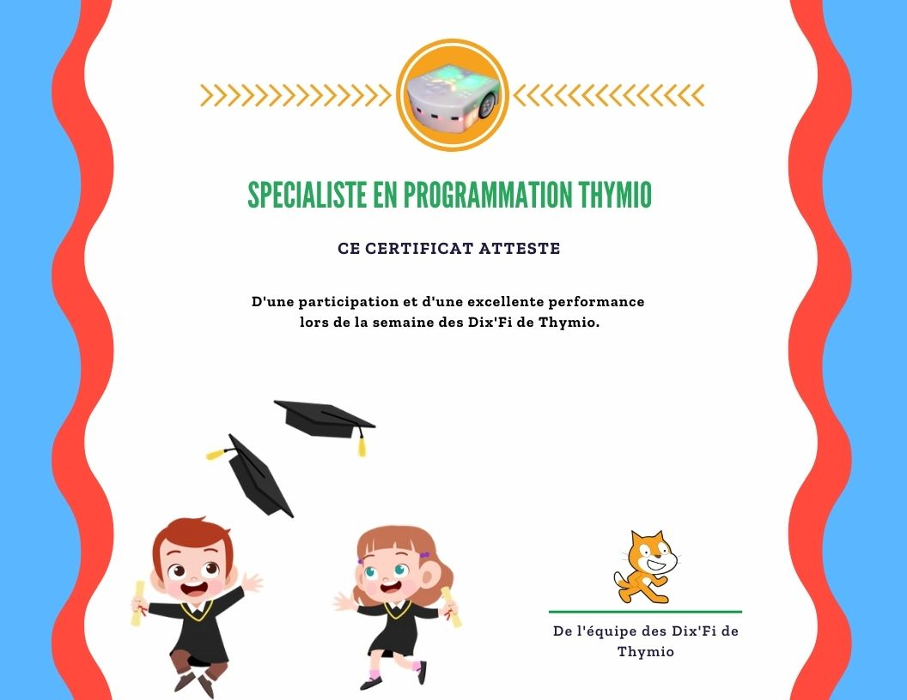
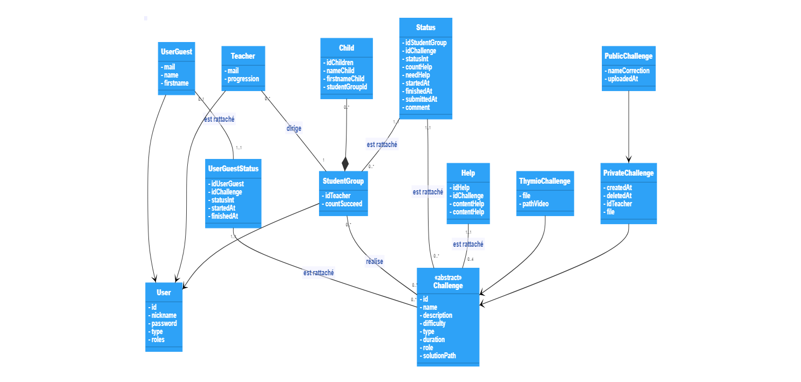

# Bienvenue sur [les DixFi de Thymio](https://thymio.tech/) !

## Qui sommes-nous ? 

Nous sommes un groupe de 4 étudiants en 3ème année de licence MIAGE à Paris 1. 
Notre groupe est composé de :

+ [Madeleine SCHMIT](https://github.com/Madde24)
+ [Rebecca GRENET](https://github.com/Rbk98)
+ [Michael NAMET](https://github.com/Michael-Namet)
+ [Richard NAKARMI](https://github.com/Richard-Nkr)

## C'est quoi les Dix'Fi de Thymio ?

C'est une application web destinée à tous ceux qui aimeraient découvrir le monde de la programmation à travers des défis à réaliser avec un petit robot, nommé Thymio !

  

L'application a été conçue pour les enseignants qui souhaitent initier leurs élèves à la programmation, notamment à l'aide de Scratch. En effet, l'objectif était de faire apprendre à des enfants (8 à 13 ans), à travers un aspect ludique, la logique du code durant tout une semaine, appelée "la semaine des Dix’Fi de Thymio".  Pour ce faire, nous avons mis à disposition une brochure pour les professeurs, les élèves mais aussi les parents, proposant un programme à suivre lors de cette semaine. 

   

L'objectif est donc de réaliser les 10 défis (d'où le nom Dix'Fi :wink: ) ou plus si l'enseignant décide de créer ses défis soi-même !   
Les apprenants pourront alors repartir avec ce diplôme ci-dessous : 

## Pré-requis et installation   

Pour pouvoir programmer les défis Thymio en Scrach, il faut installer le logiciel [Thymio Suite 2.1.5](https://www.thymio.org/fr/programmer/)  
et puis suivre les étapes [ici](https://www.thymio.org/fr/programmer/scratch/) pour utiliser l'interface Scratch.

## Langages et technos web utilisés ?

+ HTML5, CSS3, Sass, Bootsrap, JavaScript, 
+ Twig
+ Framework PHP Symfony, ORM Doctrine, phpMyAdmin/ MySQL

## Présentation à l'aide de Prezi

Voici une [présentation](https://prezi.com/p/edit/grrifcavqgra/) vous permettant de comprendre davantage l'objectif que nous avons souhaité vous transmettre 

## Diagramme de classe

